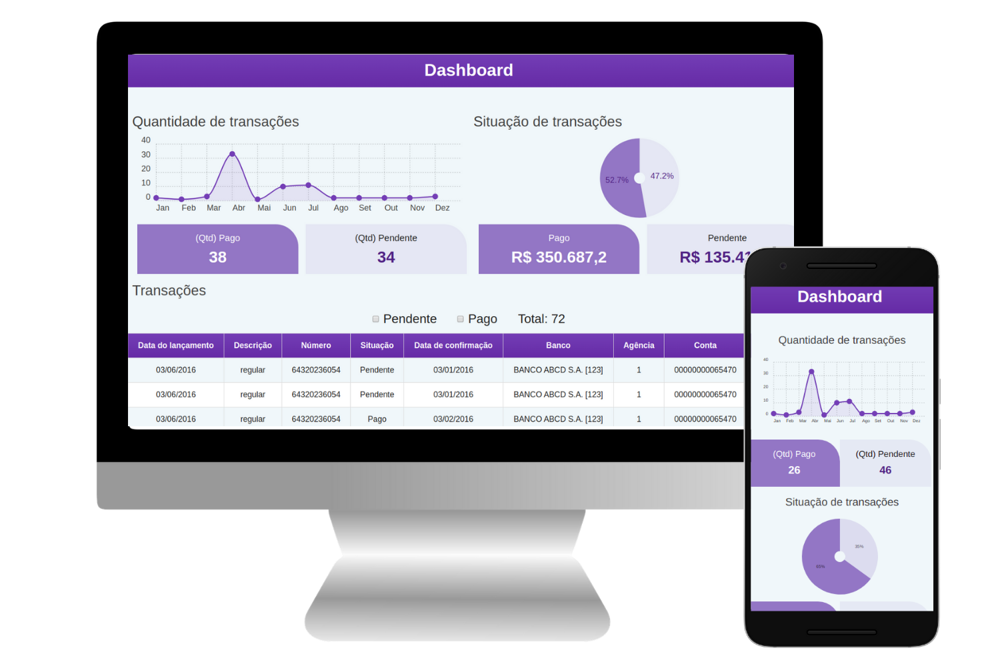

# Dashboard - Movimentação financeira.

### Objetivo:
A aplicação possibilita um usuário ter acesso a movimentações financeiras realozidas em um determidado período, também terá uma visão macro de valores 'Pago' e 'Pendente'.
O usuário poderá analizar a quantidade e porcentagem de movimentações realizadas em forma de gráficos.




[Código fonte do backend](https://github.com/marcobneves/api-java-financeiro)
  * Backend desenvolvido com a tecnologia JAVA - Spring Boot.

## Tecnologias utilizadas.

* [Angular V8](https://angular.io/)
  * Uma biblioteca JavaScript baseada para criar interfaces, aplicando conceitos de componentização e serviços.

* [Java [Spring Boot]](https://spring.io)
  * Criação do backend API-RESt baseado Spring, usado no projeto para fazer o consumo dos dados e disponibilizar para o frontend.

* [Chartist](https://gionkunz.github.io/chartist-js/)
  * Biblioteca para criação de diferentes gráficos.

* [Cucumber](https://github.com/cucumber/cucumber)
  * É uma ferramenta que suporta o BDD (Behavior-Driven Development) - um processo de desenvolvimento de software que visa melhorar a qualidade do software.

* [Protactor](https://www.protractortest.org/)
  * Ferramenta para realização de teste em aplicação Angular, e um facilitador para execução de teste em um navagador real.

* [Git](https://git-scm.com)
  * Controle de versão.


## Instalação local.

Passo 1: Clonar o projeto.

```

git clone git@github.com:marcobneves/frontend-angular-financeiro.git

```

Passo 2: Instalar as depentencias.

```

npm install ou npm i

```

Passo 3: Iniciando serve local.

```

ng serve

```

Passo 4: Execução de teste.

```

ng e2e

```
